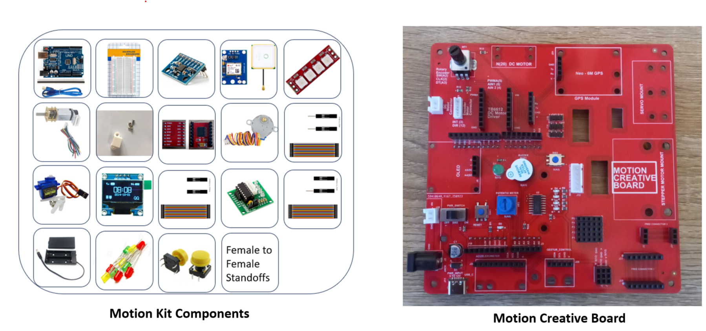

# ZAS Robotics Motion – Actuator Kit

## About This Repository

This repository contains the **Foundation Projects** for the  
**ZAS Robotics Motion Creative Kit**, a complete platform for learning robotics motion control.

The kit is designed for **students, beginners, hobbyists, and educators** to explore:

- DC motor control & speed modulation  
- Servo positioning and angle control  
- Stepper motor movements and micro-stepping  
- Encoder-based feedback & motion accuracy  
- TB6612 motor driver control  
- Basic I²C sensor and OLED display interfacing  
- Introductory robotics motion algorithms  

## What You Will Learn

- How motors work and how to control them  
- How to use PWM for speed and direction  
- How to read encoders for precise motion  
- How to use driver circuits like TB6612  
- How to build basic robotic motion mechanisms  
- How electronics, sensors, and motors work together in a robot  
